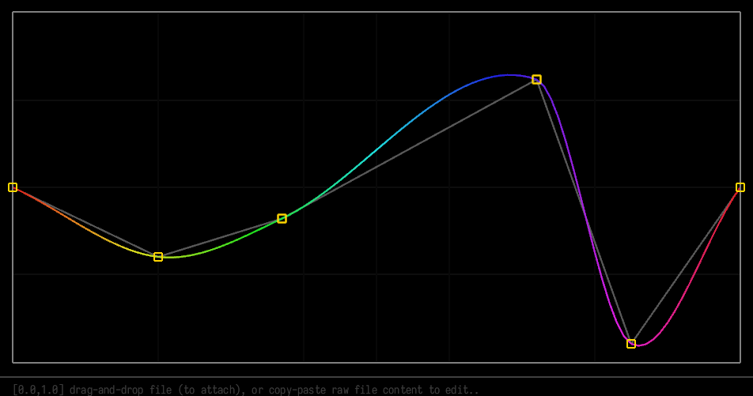

# simple tool for editing splines/curves



### install

Only option is build from sources.
You need rust and cargo.

```
cd project
cargo build --release
```

This program output only raw linear points.
if you want interpolate it, you need to use some interpolation code/library.
also you can take/rewrite code from `spline.rs`, it contain `catmull-rom` interpolation algorithm 
used for drawing.

### Hotkeys
```
Left mouse - new point
Right mouse - delete point

Left pressed mouse - move point around
-- with Ctrl - snap to grid (0.1)
-- with X - move only on X axis
-- with Y - move only on Y axis

Ctrl+C - copy curve as text
Ctrl+V - paste text as curve

Drag-and-drop file - attach file
-- Ctrl+S - save changes to file
```

### text/file format example

see [examples](./examples/):

##### linear
```
0.0000:0.0000
1.0000:1.0000
```


##### simple
```
0.0000:0.5000
0.4000:0.5000
0.5000:0.7500
0.6000:0.5000
1.0000:0.5100
```


### Known issues

- not working in full screen mode.